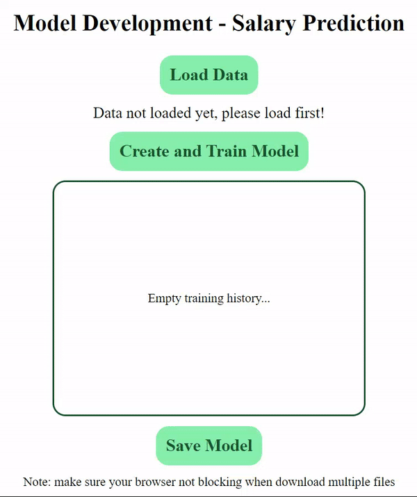
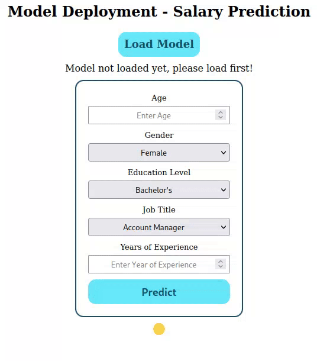
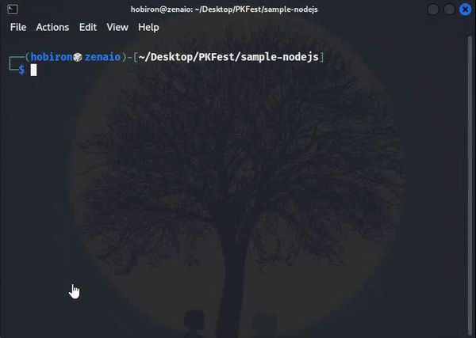
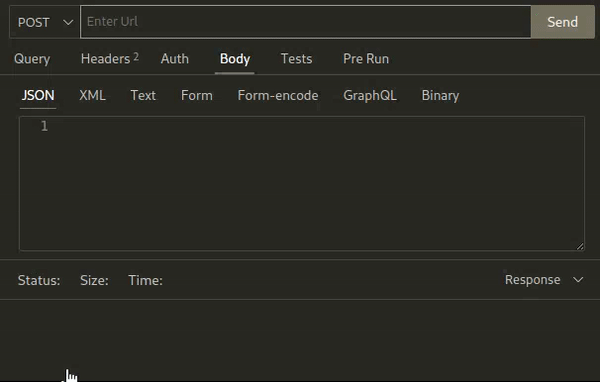
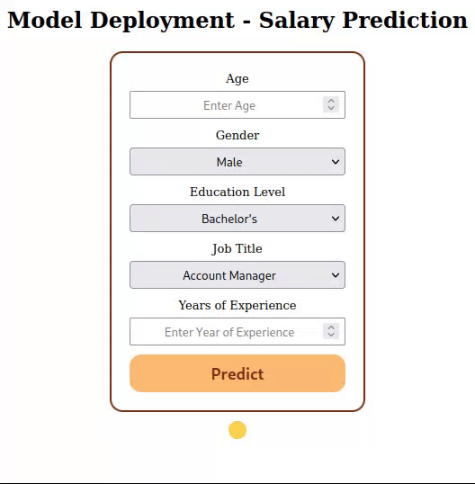

# Case Regression : Salary Prediction

## How to Run Locally

- Install [Git](https://git-scm.com/book/en/v2/Getting-Started-Installing-Git) first on your computer
- Clone this repository

```bash
git clone https://github.com/reevald/Machine-Learning-in-Web-Development.git
```

### Via Browser

- Find index.html and drag it into browser
- Ensure you are connected with Internet to load data and libraries
  - If you choose `stage-model-development/via-browser/index.html` you will get:
    
  - If you choose `stage-model-deployment/via-browser/index.html` you will get:
    

### Via NodeJs

- You need to install [NodeJs](https://nodejs.org/en/download) and [NPM](https://docs.npmjs.com/downloading-and-installing-node-js-and-npm) first
- Open related directory

```bash
cd <path directory>/via-nodejs
```

**Note**: `<path directory>` can be `case-regression/stage-model-development` or `case-regression/stage-model-deployment`

- Install dependencies

```bash
npm install
```

- Run locally

```bash
npm run start
```

- If you run on `stage-model-development/via-nodejs` you will get
  

- If you run on `stage-model-deployment/via-nodejs` you can check the endpoint of prediction using [Postman](https://www.postman.com/downloads/) or [Thunder Client](https://www.thunderclient.com/)
  

- While you run the server, you can open `index.html` (on the same folder) to see UI of prediction
  

## Contact

If you have any questions, feel free to disquss it by create an issue on this repository or contact me directly [here](https://www.thunderclient.com/). Thank you!
